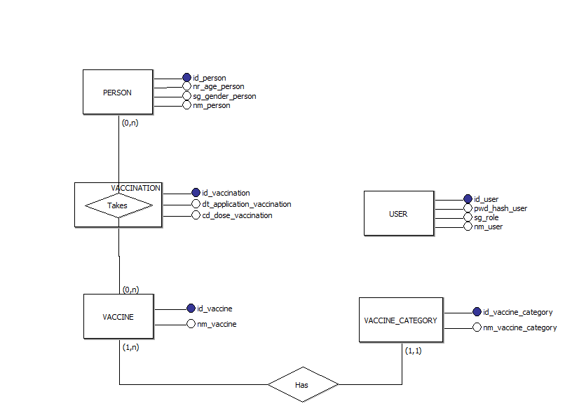
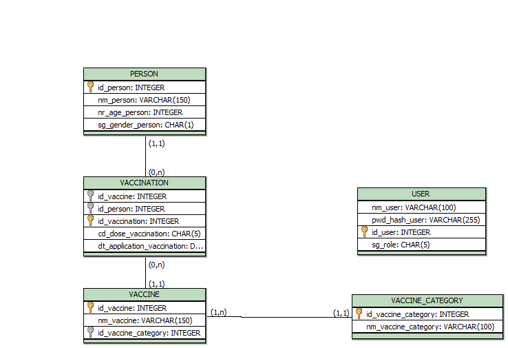

# 💉 VaccinationCard API


---

# 📑 Índice

1. [Visão Geral](#-visão-geral)
2. [Tecnologias e Ferramentas](#-tecnologias-e-ferramentas)
3. [Arquitetura e Padrões](#-arquitetura-e-padrões)
4. [Estrutura de Diretórios](#-estrutura-de-diretórios)
5. [Decisões de Design e Negócio (ADRs)](#-decisões-de-design-e-negócio-adrs)
6. [Segurança e Autenticação](#-segurança-e-autenticação)
7. [Guia de Execução (Getting Started)](#-guia-de-execução-getting-started)
8. [Testes](#-testes)
9. [Documentação da API](#-documentação-da-api)
10. [Modelagem do Banco de Dados](#-modelagem-do-banco-de-dados)

---

## 📋 Visão Geral

A **VaccinationCard API** é um sistema de backend robusto desenvolvido para a gestão de cartões de vacinação digitais. O sistema permite o cadastro de cidadãos, o gerenciamento de um catálogo de vacinas (baseado no calendário nacional) e o registro histórico de doses aplicadas, garantindo a integridade e rastreabilidade dos dados de imunização.

O projeto foi construído focando em **Qualidade de Software**, utilizando práticas de mercado como Clean Architecture, CQRS e Testes Automatizados.

---

## 🚀 Tecnologias e Ferramentas

O projeto foi desenvolvido utilizando **C#** e **.NET 8**. Abaixo, as principais bibliotecas e a justificativa para sua escolha:

* **Entity Framework Core + SQLite:** Escolhido pela portabilidade e facilidade de configuração local, permitindo persistência robusta sem necessidade de instalar servidores de banco pesados.
* **MediatR:** Utilizado para implementar o padrão **CQRS** (Command Query Responsibility Segregation), desacoplando totalmente os Controllers da lógica de negócio.
* **FluentValidation:** Implementação da estratégia *Fail-fast*. As regras de negócio (ex: idade negativa, dose inválida) são validadas antes mesmo de tocar o domínio.
* **AutoMapper:** Para realizar a transformação entre Entidades (Domínio) e DTOs (Contratos de API), evitando exposição de dados sensíveis.
* **BCrypt.Net:** Padrão da indústria para hash de senhas. Nenhuma senha é salva em texto puro.
* **xUnit + Moq + FluentAssertions:** Stack de testes para garantir que a lógica de negócio (Handlers) funcione isoladamente e corretamente.
* **Swashbuckle (Swagger):** Para documentação interativa e teste manual da API.

---

## 🏛️ Arquitetura e Padrões

O projeto segue estritamente a **Clean Architecture**, dividindo as responsabilidades em camadas concêntricas:

1. **Domain (Núcleo):** Contém as Entidades (`Person`, `Vaccine`, `User`), Interfaces de Repositório e Regras de Negócio puras. Não depende de nenhuma outra camada.
2. **Application (Orquestração):** Contém os Casos de Uso implementados via **CQRS** (`Commands` para escrita, `Queries` para leitura), DTOs e Validadores.
3. **Infrastructure (Mundo Externo):** Implementa o acesso a dados (`Repositories`, `DbContext`), serviços de criptografia e geração de tokens JWT.
4. **Api (Entrada):** Contém os Controllers REST e configurações de Middleware. Apenas recebe a requisição e entrega para o `MediatR`.

### Padrões Utilizados
* **CQRS:** Separação clara entre operações de Leitura e Escrita, permitindo otimizações futuras e código mais limpo.
* **Repository Pattern:** Abstração da camada de dados, facilitando a troca de banco de dados e a criação de Mocks para testes.
* **Dependency Injection:** Uso extensivo do container nativo do .NET para inversão de controle.

---

## 📂 Estrutura de Diretórios

```text
VaccinationCardSolution/
├── src/
│   ├── VaccinationCard.Api/           # Controllers, Configuração, Middleware Global
│   ├── VaccinationCard.Application/   # UseCases (CQRS), DTOs, Validators, Interfaces
│   ├── VaccinationCard.Domain/        # Entidades, Enums, Exceptions Customizadas
│   └── VaccinationCard.Infrastructure/# EF Core, Repositories, Services (Auth)
└── tests/
    ├── VaccinationCard.UnitTests/        # Testes de Lógica (Handlers) com Mocks
    └── VaccinationCard.IntegrationTests/ # Testes E2E (API + Banco em Memória)
```

---

## 🧠 Decisões de Design e Negócio (Architectural Decision Records)

Nesta seção, documentei as escolhas estratégicas feitas durante o desenvolvimento para equilibrar os requisitos do desafio com as melhores práticas de engenharia de software.

### 1. Gerenciamento de Vacinas: Data Seeding vs. CRUD Público
* **O Dilema:** O desafio solicitava a funcionalidade de "Cadastrar uma vacina". No entanto, em sistemas de saúde reais, vacinas são **Dados de Referência (Reference Data)** padronizados pelo Ministério da Saúde. Permitir que qualquer usuário cadastre vacinas geraria duplicidade (ex: "Flu", "Gripe", "Influenza") e inconsistência nos relatórios.
* **A Decisão:**
    1.  Priorizei a integridade dos dados utilizando **Data Seeding** (`DbInitializer`). Isso garante que o sistema nasça com o catálogo oficial carregado, facilitando o teste imediato do avaliador sem necessidade de configuração manual prévia.
    2.  Para atender estritamente ao requisito funcional do desafio, implementei os endpoints de gestão (`POST`, `PUT`, `DELETE` em `/api/Vaccines`), mas os protegemos via **RBAC (Role-Based Access Control)**. Apenas usuários com perfil **ADMIN** podem alterar o catálogo, simulando um cenário de Backoffice real.

### 2. Estrutura de Categorias: Normalização vs. Visualização
* **O Problema:** A interface visual de referência sugere um "Grid Único" (Carteira Nacional), mas clinicamente, algumas vacinas (ex: Meningo B) pertencem à rede particular. O dilema era: simplificar o banco para ter uma categoria só ou modelar corretamente?
* **A Decisão (Arquitetura Data-Driven):** Optei por manter o banco de dados **normalizado e semântico** (Padrão *Source of Truth*).
    * **Backend (Verdade):** As vacinas são cadastradas em suas categorias reais ("Básica SUS", "Particular", etc.) no banco de dados via Seed.
    * **Frontend (Visualização):** A estrutura 1:N entre `VaccineCategory` e `Vaccine` foi mantida. Isso permite que o Frontend trate a "Carteira Nacional" como uma visão agregadora, exibindo vacinas essenciais independente de sua categoria no banco. Essa abordagem facilita a manutenção futura caso novas abas precisem ser criadas apenas via SQL, sem refatoração de código.

### 3. Estratégia de Exclusão: Verbose Delete
* **O Problema:** O padrão REST sugere retornar `204 No Content` para exclusões bem-sucedidas. Porém, em sistemas críticos de saúde, o usuário precisa de feedback claro sobre o que acabou de remover para evitar erros operacionais (ex: apagar o registro do paciente errado).
* **A Decisão:** Implementei o **Verbose Delete**. Os endpoints `DELETE` retornam status `200 OK` contendo o JSON do objeto excluído. Isso melhora a **Experiência do Usuário (UX)**, permitindo que o Frontend exiba mensagens de confirmação precisas (ex: *"O registro de vacina BCG de Murillo foi removido"*).

### 4. Tratamento de Erros: Global Exception Handler
* **O Problema:** Validar regras de negócio (ex: "Idade não pode ser negativa", "Vacina já aplicada") dentro dos Controllers gera código repetitivo e "sujo" com múltiplos blocos `try-catch`.
* **A Decisão:** Utilizei o middleware `IExceptionHandler` nativo do .NET 8.
    * Criei uma exceção personalizada `DomainException`.
    * O Controller executa apenas o "caminho feliz". Se uma regra for violada, o Middleware intercepta o erro e padroniza a resposta JSON como **400 Bad Request** (conforme a [RFC 7807](https://tools.ietf.org/html/rfc7807)). Isso mantém os Controllers limpos e focados apenas na orquestração HTTP.

### 5. Segurança Ofensiva: Bloqueio de Rotas Destrutivas

| Recurso | Endpoint | Método | Ação | Acesso USER | Acesso ADMIN |
| :--- | :--- | :---: | :--- | :---: | :---: |
| **Auth** | `/api/Auth/register` | `POST` | Criar Usuário | ✅ Público | ✅ Público |
| | `/api/Auth/login` | `POST` | Obter Token | ✅ Público | ✅ Público |
| **Persons** | `/api/Persons` | `POST` | Criar Paciente | ✅ Sim | ✅ Sim |
| | `/api/Persons` | `GET` | Listar Todos | ✅ Sim | ✅ Sim |
| | `/api/Persons/{id}` | `GET` | Ver Cartão | ✅ Sim | ✅ Sim |
| | `/api/Persons/{id}` | `PUT` | Editar Paciente | ✅ Sim | ✅ Sim |
| | `/api/Persons/{id}` | `DELETE` | Apagar Paciente | ❌ **Proibido** | ✅ **Permitido** |
| **Vaccines** | `/api/Vaccines` | `GET` | Listar Catálogo | ✅ Sim | ✅ Sim |
| | `/api/Vaccines` | `POST` | Criar Vacina | ❌ **Proibido** | ✅ **Permitido** |
| | `/api/Vaccines/{id}` | `PUT` | Corrigir Nome | ❌ **Proibido** | ✅ **Permitido** |
| | `/api/Vaccines/{id}` | `DELETE` | Apagar Vacina | ❌ **Proibido** | ✅ **Permitido** |
| **Vaccinations**| `/api/Vaccinations` | `POST` | Aplicar Dose | ✅ Sim | ✅ Sim |
| | `/api/Vaccinations/{id}`| `GET` | Ver Detalhe | ✅ Sim | ✅ Sim |
| | `/api/Vaccinations/{id}`| `PUT` | Corrigir Dose | ✅ Sim | ✅ Sim |
| | `/api/Vaccinations/{id}`| `DELETE` | Estornar Dose | ❌ **Proibido** | ✅ **Permitido** |
---

## 🔒 Segurança e Autenticação

A API é protegida via **JWT (JSON Web Token)**.

1. **Registro/Login:** O usuário envia credenciais. A API valida o hash da senha (BCrypt) e retorna um Token assinado.
2. **Acesso:** O cliente deve enviar o cabeçalho `Authorization: Bearer <TOKEN>` em todas as requisições protegidas.
3. **Swagger:** A documentação possui suporte nativo (botão cadeado 🔒) para testar endpoints autenticados.

---

## ⚡ Guia de Execução (Getting Started)

### 🛠️ Pré-requisitos

* **[.NET 8 SDK](https://dotnet.microsoft.com/download/dotnet/8.0)**: Necessário para compilar e rodar a aplicação.
* **Git**: Para clonar o repositório.

### 🚀 Como Rodar (Passo a Passo)

1.  **Clone o repositório:**
    ```bash
    git clone https://github.com/seu-usuario/vaccination-card-api.git
    cd VaccinationCardSolution
    ```

2.  **Execute a API:**
    A aplicação utiliza **SQLite**. Não é necessário instalar nenhum banco de dados externo.
    Ao rodar o comando abaixo, o sistema irá automaticamente:
    * Criar o arquivo do banco (`vaccination_card.db`).
    * Aplicar as migrações (Tabelas).
    * Popular os dados iniciais (Vacinas do SUS e Usuário Admin).
    
    ```bash
    dotnet run --project src/VaccinationCard.Api
    ```

3.  **Acesse a Documentação Interativa:**
    Abra o navegador no endereço indicado no terminal (geralmente porta 5000 ou 5205).
    👉 **http://localhost:5205/swagger**

### 🔑 Credenciais de Acesso (Seed Automático)

O sistema vem pré-configurado com um superusuário para facilitar a avaliação:

| Role | Username | Password | Permissões |
| :--- | :--- | :--- | :--- |
| **ADMIN** | `admin` | `admin123` | Acesso Total (Inclui `DELETE` e gestão de catálogo). |
| **USER** | *(Criar via API)* | *(Criar via API)* | Operacional (Registrar vacinação, Consultar). |

---

### 🕵️‍♂️ Como Testar os Perfis (Tutorial de Segurança)

Para validar o sistema de segurança **RBAC** (Role-Based Access Control), siga este roteiro no Swagger:

#### 1. Testando o "Poder Total" (ADMIN)
1.  No Swagger, vá em **Auth** -> `POST /api/Auth/login`.
2.  Use as credenciais de seed (`admin` / `admin123`).
3.  Copie o **Token** gerado na resposta (string longa).
4.  Suba ao topo da página, clique no botão **Authorize** (cadeado) e cole o token no formato:
    `Bearer <seu_token_aqui>`
5.  Agora tente deletar um paciente (`DELETE /api/Persons/1`).
    * **Resultado:** ✅ `200 OK` (A operação é permitida).

#### 2. Testando o "Acesso Restrito" (USER)
1.  Crie um usuário comum em `POST /api/Auth/register` (ex: `username: "enfermeiro"`).
2.  Faça login com ele e pegue o novo Token.
3.  Troque o token no botão **Authorize** (faça Logout antes).
4.  Tente criar uma nova vacina no catálogo (`POST /api/Vaccines`).
    * **Resultado:** 🚫 `403 Forbidden` (O sistema bloqueia a ação, provando que a segurança funciona).

---

## 🧪 Testes

O projeto possui uma suíte de testes abrangente.

### Como Rodar

```bash
dotnet test
```

### Cobertura

* **Testes Unitários (`xUnit` + `Moq`):** Cobrem 100% dos *Handlers* (Casos de Uso). Validam regras de negócio, cálculos de idade, validação de doses e exceções de domínio, isolando o banco de dados.
* **Testes de Integração (`WebApplicationFactory`):** Validam o fluxo completo (HTTP → Auth → Banco em Memória), garantindo que a API responde corretamente e que o token JWT é validado.

---

## 📖 Documentação da API

A API é totalmente documentada via **Swagger UI** (acessível em `/swagger`). Abaixo, o detalhamento dos recursos, suas responsabilidades e níveis de acesso:

### 🔐 Auth (Autenticação)
*Responsável pela emissão de credenciais.*
* `POST /api/Auth/register`: Criação de novos usuários no sistema.
* `POST /api/Auth/login`: Autenticação via credenciais. Retorna o **Bearer Token** JWT necessário para acessar as rotas protegidas.

### 👤 Persons (Pacientes)
*Gestão do cadastro de cidadãos e visualização do cartão.*
* `GET /api/Persons`: Lista todos os cidadãos cadastrados.
* `GET /api/Persons/{id}`: **[Destaque]** Retorna o **Cartão de Vacinação Digital** completo (Dados pessoais + Histórico de doses tomadas).
* `POST /api/Persons`: Cadastra um novo cidadão.
* `PUT /api/Persons/{id}`: Atualiza dados cadastrais (Nome, Idade, etc).
* `DELETE /api/Persons/{id}`: 🛡️ **Restrito (Admin)**. Remove o cidadão e **exclui em cascata** todo o seu histórico de vacinação.

### 💉 Vaccinations (Registro de Doses)
*O "Core" do sistema. Registra o ato de vacinar (Vínculo: Pessoa + Vacina + Dose + Data).*
* `POST /api/Vaccinations`: Registra uma dose aplicada.
    * *Validações:* Impede datas futuras, verifica existência de paciente/vacina e valida tipos de dose (D1, D2, R1...).
* `GET /api/Vaccinations/{id}`: Consulta detalhes de um registro de aplicação específico.
* `PUT /api/Vaccinations/{id}`: Permite correção de lançamentos errados (ex: data ou dose incorreta).
* `DELETE /api/Vaccinations/{id}`: 🛡️ **Restrito (Admin)**. Permite o estorno/remoção de um lançamento de vacina.

### 🧪 Vaccines (Catálogo de Imunizantes)
*Gerenciamento dos Dados de Referência (Carregados via Seed).*
* `GET /api/Vaccines`: Lista todas as vacinas disponíveis no catálogo para preencher o grid de seleção.
* `POST /api/Vaccines`: 🛡️ **Restrito (Admin)**. Adiciona novas vacinas ao catálogo.
* `PUT /api/Vaccines/{id}`: 🛡️ **Restrito (Admin)**. Corrige nomes ou categorias de vacinas.
* `DELETE /api/Vaccines/{id}`: 🛡️ **Restrito (Admin)**. Remove vacinas do catálogo.
    * *Trava de Segurança:* O sistema **impede** a exclusão se a vacina já tiver sido aplicada em algum paciente, garantindo integridade histórica.

---

# 🗄 Modelagem do Banco de Dados

Abaixo estão os espaços reservados para os diagramas.

## 🧩 Modelo Conceitual  


---

## 🧠 Modelo Lógico  


---

## 🧱 Modelo Físico (SQL ANSI 2003 – brModelo)

```sql
-- Sql ANSI 2003 - brModelo.

CREATE TABLE PERSON (
id_person INTEGER PRIMARY KEY,
nm_person VARCHAR(150) NOT NULL,
nr_age_person INTEGER NOT NULL,
sg_gender_person CHAR(1) NOT NULL
)

CREATE TABLE VACCINE (
id_vaccine INTEGER PRIMARY KEY,
nm_vaccine VARCHAR(150) NOT NULL,
id_vaccine_category INTEGER NOT NULL
)

CREATE TABLE VACCINE_CATEGORY (
id_vaccine_category INTEGER PRIMARY KEY,
nm_vaccine_category VARCHAR(100) NOT NULL
)

CREATE TABLE USER (
id_user INTEGER PRIMARY KEY,
nm_user VARCHAR(100) NOT NULL UNIQUE,
pwd_hash_user VARCHAR(255) NOT NULL,
sg_role CHAR(5) NOT NULL DEFAULT 'USER'
)

CREATE TABLE VACCINATION (
id_vaccine INTEGER NOT NULL,
id_person INTEGER NOT NULL,
id_vaccination INTEGER PRIMARY KEY,
cd_dose_vaccination CHAR(5) NOT NULL,
dt_application_vaccination DATE NOT NULL,
FOREIGN KEY(id_vaccine) REFERENCES VACCINE (id_vaccine),
FOREIGN KEY(id_person) REFERENCES PERSON (id_person)ON DELETE CASCADE
)

ALTER TABLE VACCINE ADD FOREIGN KEY(id_vaccine_category) REFERENCES VACCINE_CATEGORY (id_vaccine_category)
```
